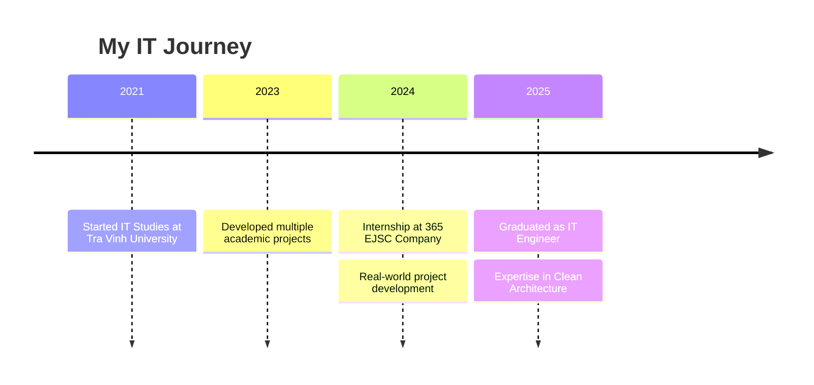

# 👋 Xin chào, tôi là Trần Bá Hiếu

---

## 🚀 About Me

- 🎓 **Kỹ Sư Công Nghệ Thông Tin** tại Đại Học Trà Vinh
- 💼 **Thực tập sinh** tại **365 EJSC** - Công ty Cổ phần Hệ sinh thái 365
- 🌱 Chuyên sâu về **ASP.NET Core** và **Clean Architecture**
- 💻 Đam mê phát triển **Full Stack Web Applications**
- 🎯 Mục tiêu: Trở thành **Senior Software Engineer**

### 📊 GitHub Stats

---

## 🛠️ Tech Stack & Skills

### Frontend Development

### Backend Development

### Database & DevOps

### Tools & Others

---

## 🏆 Featured Projects

### 🎯 Academic Projects

<table>
<tr>
<td width="50%">

#### 📝 Text Similarity Tool
- **Mô tả**: Công cụ so sánh tương đồng văn bản
- **Công nghệ**: Cosine Similarity, Matthanan Algorithm
- **Ứng dụng**: Phát hiện đạo văn, phân tích nội dung

</td>
<td width="50%">

#### 🍎 Apple Store Website
- **Mô tả**: Website bán sản phẩm Apple
- **Công nghệ**: HTML, CSS, JavaScript, Bootstrap
- **Tính năng**: Responsive Design, Shopping Cart

</td>
</tr>
<tr>
<td width="50%">

#### 💻 Computer Store Website
- **Mô tả**: Website kinh doanh máy vi tính
- **Công nghệ**: ASP.NET MVC, SQL Server
- **Tính năng**: Quản lý sản phẩm, Đặt hàng online

</td>
<td width="50%">

#### 👤 Face Recognition System
- **Mô tả**: Hệ thống nhận diện khuôn mặt điểm danh
- **Công nghệ**: OpenCV, Machine Learning
- **Ứng dụng**: Điểm danh học sinh/sinh viên

</td>
</tr>
</table>

### 💼 Professional Projects

<table>
<tr>
<td width="50%">

#### 🏢 Seiki Job Portal (世紀)
- **Mô tả**: Website việc làm Nhật Bản
- **Công nghệ**: ASP.NET Core, Clean Architecture
- **Vai trò**: Backend Developer

</td>
<td width="50%">

#### 🏘️ Ngọc Vân Phương Real Estate
- **Mô tả**: Website bất động sản Vĩnh Long
- **Công nghệ**: ASP.NET Core, RESTful API
- **Vai trò**: Full Stack Developer

</td>
</tr>
</table>

---

## 📈 Activity Graph

---

## 🎓 Education & Experience

### 🏫 Education
- **🎓 Đại Học Trà Vinh** - Công Nghệ Thông Tin (2021-2025)
- **📍 Quê quán**: Vĩnh Long
- **📅 Sinh năm**: 16/11/2003

### 💼 Experience
- **🏢 365 EJSC** - Software Engineer Intern (2024-2025)
  - 1 năm hoạt động dự án thực tế
  - 2 tháng thực tập chính thức
  - Phát triển API với Clean Architecture

---

## 📞 Contact Me

---

### 🌟 "Code is poetry, and every bug is a learning opportunity"

**💖 Thanks for visiting my profile!**

